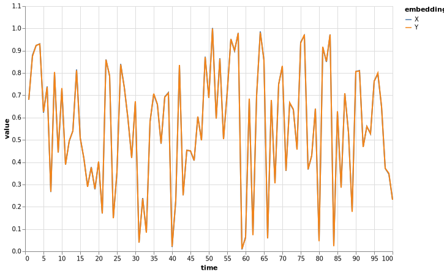
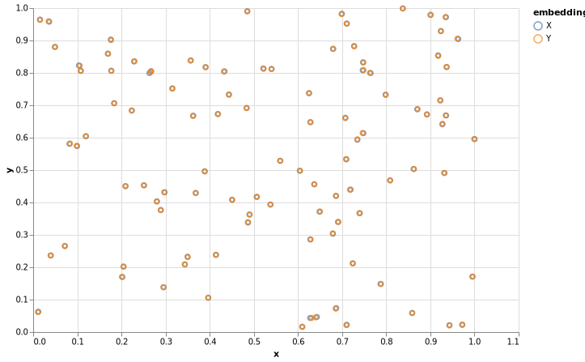

# TripletEmbeddings.jl
This package implements various triplet embedding algorithms.

## Usage
### Multithreading
This package uses threads to compute the gradients. To set the number of threads in Julia, open a terminal and run:

```bash
$ export JULIA_NUM_THREADS=n
```
where `n` is the number of threads you want to use.

### Installation
This package is currently not registered. To install, open a REPL and install directly from this repo:

```julia
julia> ]
(v1.0) pkg> add https://github.com/usc-sail/TripletEmbeddings.jl
```
To use this package, you can now use:

```julia
julia> using TripletEmbeddings
```

### Implemented loss functions
Currently, STE and tSTE are implemented. These can be called by

```julia
using TripletEmbeddings

loss = STE(σ = 1/sqrt(2)) # or simply STE()
loss = tSTE(α = 2) # or simply tSTE()
```

### Examples
#### 1D embeddings
We generate a random signal, compute its triplets, and then fit an embedding to those triplets:

```julia
using Random
using VegaLite
using StatsFuns
using DataFrames
using TableReader
using Distributions
using TripletEmbeddings

Random.seed!(4)

n = 100
Y = 2*rand(1,n) .- 1

# Triplets accepts a function that drives the triplet labeling error. In this case, the logistic function is used
triplets = Triplets(Y; f = x -> logistic(20x))
loss = STE(σ = 1/sqrt(2))
X = Embedding(size(Y))

@time violations = fit!(loss, triplets, X; verbose=true, max_iterations=1000)
procrustes!(X, Y)

dfX = DataFrame(embedding = "X", time = 1:n, value = X[1,:])
dfY = DataFrame(embedding = "Y", time = 1:n, value = Y[1,:])

vcat(dfX, dfY) |> @vlplot(:line, x = :time, y = :value, color=:embedding, width=600, height=400)
```
This code generates the following embedding:



#### Embeddings of 2 or more dimensions

```julia
using Plots
using Random
using VegaLite
using DataFrames
using TableReader
using LinearAlgebra
using TripletEmbeddings

Random.seed!(4)

# We define a random Embedding in ℜ²
d = 2
n = 100
Y = rand(d, n)

triplets = Triplets(Y)
loss = STE(σ = 1/sqrt(2))
X = Embedding(size(Y))

@time violations = fit!(loss, triplets, X; verbose=true, max_iterations=200)
procrustes!(X, Y)

scatter(Y[1,:], Y[2,:]); scatter!(X[1,:], X[2,:])

dfX = DataFrame(embedding = "X", time = 1:n, x = X[1,:], y = X[2,:])
dfY = DataFrame(embedding = "Y", time = 1:n, x = Y[1,:], y = Y[2,:])

vcat(dfX, dfY) |> @vlplot(:point, x = :x, y = :y, color=:embedding, width=600, height=400)
```
This code generates the following embedding:

